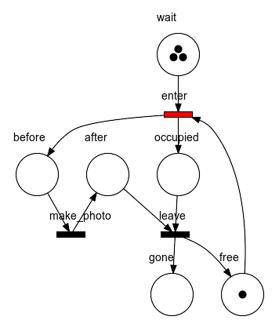

# Petrinet

A command line utility for generating animated gifs of petri nets. This tool is designed to support living
documentation and test-driven development of systems that can be modelled with petri nets.

## Example

An X-Ray machine in a hospital, taken from [Modeling Business Processes - A Petri Net-Oriented Approach](https://mitpress.mit.edu/books/modeling-business-processes).



The input for generating this gif is two files:

* a [PNML](https://en.wikipedia.org/wiki/Petri_Net_Markup_Language) file, for example created with 
  [PIPE](https://sarahtattersall.github.io/PIPE/) or other petri net diagramming tool.
* a *marking-transition* script

## Marking-Transition script

This is a simple text file to specify the initial *marking* of the net, and transitions to fire. The animation
above was generated from the following marking file:

```
wait:3
free:1
enter
make_photo
leave
enter
make_photo
leave
enter
make_photo
leave
```

This file can be written by hand, or it can be generated.

### Generating a Marking-Transition script

There are two typical ways to generate a marking-transition script - either via *controlled* automated tests,
or from a running production system. Both of them require the system to *log* internal events and commands.

A specialised (but simple) tool could parse those logs and generate a marking-transition script, which can then
be fed to `petrinet` for validation and generation of living documentation in the form of animated petri nets.

## Installation

You need the following tools installed:

* Graphviz - the `dot` executable must be on your `PATH`
* ImageMagick - the `convert` executable must be on your `PATH`
* Ruby

Then run the following from the command line:

    gem install petrinet

## Usage

You need a `.pnml` file that describes your net, and a `.txt` marking-transition file. Generate an animated gif:

    petrinet --script my-marking-transition.txt my-petri-net-pnml.xml

This will generate a file named `my-marking-transition.gif` (the name is derived from the `.txt` file)

## Contributing

Bug reports and pull requests are welcome on GitHub at https://github.com/cucumber/petrinet.

## License

The gem is available as open source under the terms of the [MIT License](https://opensource.org/licenses/MIT).
