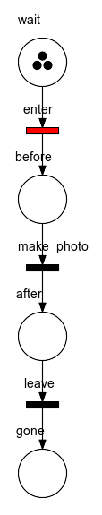

# Petrinet

A command line utility for generating animated gifs of petri nets. Here is an example:



The input for generating this gif is two file:

* a [PNML](https://en.wikipedia.org/wiki/Petri_Net_Markup_Language) file, for example created with 
  [PIPE](https://sarahtattersall.github.io/PIPE/) or other petri net diagramming tool.
* a *marking-transition* script

## Marking-Transition script

This is a simple text file to specify the initial *marking* of the net, and transitions to fire. For example:

```
wait:3
enter
make_photo
enter
enter
```

This can be written by hand, or it can be generated.

A typical use case is to use automated tests running against a system, record events happening in the system,
and generate the file from that. This way, living documentation can be generated from those tests.

## Prerequisites

You need the following tools installed:

* Graphviz - the `dot` executable must be on your `PATH`
* ImageMagick - the `convert` executable must be on your `PATH`

## Installation

Add this line to your application's Gemfile:

```ruby
gem 'petrinet'
```

And then execute:

    $ bundle

Or install it yourself as:

    $ gem install petrinet

## Usage

TODO: Write usage instructions here

## Development

After checking out the repo, run `bin/setup` to install dependencies. Then, run `rake spec` to run the tests. You can also run `bin/console` for an interactive prompt that will allow you to experiment.

To install this gem onto your local machine, run `bundle exec rake install`. To release a new version, update the version number in `version.rb`, and then run `bundle exec rake release`, which will create a git tag for the version, push git commits and tags, and push the `.gem` file to [rubygems.org](https://rubygems.org).

## Contributing

Bug reports and pull requests are welcome on GitHub at https://github.com/cucumber/petrinet.

## License

The gem is available as open source under the terms of the [MIT License](https://opensource.org/licenses/MIT).
